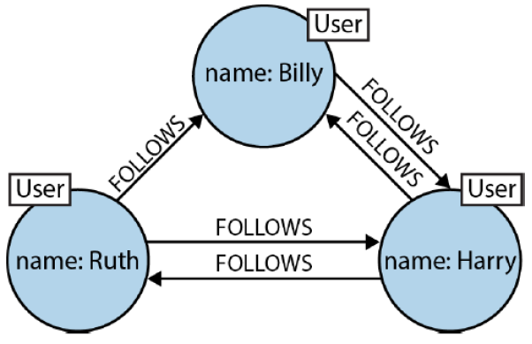

## Goal
The aim of this project was to build a model that can predict the price of the cars based on certain parameters as precisely as possible.

## Authors
Bodo Gruetter, Malik Sogukoglu

## Source of dataset
https://www.kaggle.com/orgesleka/used-cars-database

## Description of variables in the dataset
 - dateCrawled: Date when data record was crawled
 - name: name of the car
 - seller: information whether seller was "gewerblich"(commercial) or "privat"(private)
 - offerType: information if car was searched ("Gesuch") or offered ("Angebot") 
 - price: Price of car
 - abtest: information if auto has been tested ("test") or the test is still pending ("control").
 - vehicleType: information about the class of the car
 - yearOfRegistration: car's year of registration
 - gearbox: information whether the gearbox is automatic or manual.
 - powerPS: horsepower of the car
 - model: model of the car
 - kilometer: kilometers covered by the car
 - monthOfRegistration: month of registration of the car
 - fuelType: information whether fuel type is "diesel" or "benzin".
 - brand: brand of the car
 - notRepairedDamage: information whether car has not repaired damage or not
 - dateCreated; information when data was crawled
 - nrOfPictures: unknown
 - postalCode: information where car is at the moment
 - lastSeen: information when car was last seen.
   

# 0. Import Packages and prepare environment
```{r, message=FALSE, warning=FALSE}
library(igraph)
library(mgcv)
library(tidyverse)
library(igraphdata)
library(corrplot)
library("ggplot2")
```

## Prepare Environment
Set seed for reproducability:
```{r, message=FALSE, warning=FALSE}
set.seed(123)
```
Clear environment:
```{r, message=FALSE, warning=FALSE}
rm(list = ls())
```
Set plotting window to default:
```{r, message=FALSE, warning=FALSE}
par(mfrow = c(1, 1))
```

# 1. Prepare Data

CSV is read whereby zero values are explicitly marked as NAs:
```{r}
df.cars <- read.csv2(file="autos.csv", sep = ",", header = T, na.strings = c("", " ", "NA"))
```
remove NAs:
```{r}
df.cars <- na.omit(df.cars)
```
To predict price of cars, it is useful to select "price" as the target variable and "kilometres" as well as "yearOfRegistration" could be good independent variables.

With the following plots it is shown how "kilometres" resp. "yearOfRegistration" stand to the variable "price".
```{r}
plot(df.cars$price ~df.cars$kilometer)
```

```{r}
plot(df.cars$price ~df.cars$yearOfRegistration)
```

The unrealistic "price" and "yearOfRegistration" data in the plots above clearly show that there are outliers which should be filtered. These unrealistic values are probably caused by failures during crawling.

Filter outliers:
- To get rid of these unrealistic values, only cars with a value up to 100000 Euros and only the models between 2010 and 2016 are considered. 
```{r}
df.cars <- df.cars %>% filter(yearOfRegistration > 2010, 
                              yearOfRegistration < 2016, 
                              price < 100000)
```
The following example-boxplot shows that by filtering to the years 2010 - 2016 the graphic became much more visible
```{r}
boxplot(df.cars$price ~df.cars$yearOfRegistration)
```

Columns "lastSeen|nrOfPictures|dateCreated|dateCrawled" are removed since they obviously do not provide useful information.
Even if it would influence the price, it would probably be a false correlation.
```{r}
df.cars = subset(df.cars, select = -c(lastSeen,nrOfPictures,dateCreated,dateCrawled) )
```

The "age" of the car would be an important value to calculate the price. 
Since it was not included in the data set, it is inserted here as a new column: 
(Note: 2016 is the year of data collection)
```{r}
df.cars$age <- 2016 - df.cars$yearOfRegistration
```

See if/how many "NA"s exist...
```{r}
anyNA(df.cars)
apply(df.cars, MARGIN = 2, 
      FUN = function(x) {sum(is.na(x))})
```
...seems there aren't any which is good.

# 2. Graphical Analysis

We assumed that "yearOfRegistration" and "kilometer" strongly influence the "price". With the following correlation analyis we want to see which variables actually influence the price.

## 2.1. Correlation analysis 
The following correlation plot shows which variables influence price:
```{r}
predictors = c(colnames(df.cars))
corrplot(cor(data.matrix(df.cars[predictors]) ))
```

Above, We see that 
 - yearOfRegistration
 - powerPS
 - age (calculated from yearOfRegistration)
 - kilometer
 - name
 - brand
 - fuel type
 - gearbox
 - vehicle Type
 - notRepairedDamage
 - postalCode
have a certain influence on the price. So, there are also variables that we did not think as having a strong effect previously.

In the following analysis we will take a closer look at the effects of the categorical and numerical variables that influence the price according to the correlation plot.

## 2.2. Categorical variables
...lets start with the categorical values. Those are best explaint with boxplots and Anova-tests. 

lets see which are the categorical:
```{r}
sapply(df.cars, class)
```
...the independent categorical variables to be considered are
- yearOfRegistration
 - name
 - brand
 - fuel type
 - gearbox
 - vehicle Type
 - notRepairedDamage
 - postalCode
 - age

Now that all necessary independent variables have been determined, it is important to ensure that the dependent variable "price" follows a normal distribution: 
```{r}
hist(df.cars$price)
```
......and it does not, so the values in this column are to be squered squared:
```{r}
df.cars$price <- sqrt(df.cars$price)
hist(df.cars$price)
```
... after squaring, price is now normally distributed and thus suitable for analysis.


lm.cars below is the dummy model that contains every independent variable. This will be used for comparison with other models:
```{r}
lm.cars <- lm(price ~ 1, data = df.cars)
```

### year of registration
```{r}
ggplot(data = df.cars, aes(group=yearOfRegistration, y = price, x = as.factor(yearOfRegistration))) +
   geom_boxplot() + xlab("year of registration") + ylab("price")
```
```{r}
lm.yearOfRegistration <- lm(price ~ as.factor(yearOfRegistration), data = df.cars)
anova(lm.cars, lm.yearOfRegistration)
```
- The boxplot above clearly shows that the year of registration influences the price, because newer cars cost more. 
- The anova test shows that there is a strong evidence that at least one year-level influences the price (see p-value) .
- The anova test shows also that the model only having yearOfRegistration as independent variable has smaller residuals than the dummy model (see RSS).

### name
Because name has many levels it is not suitable for plotting and Anova-test.

### brand
```{r}
ggplot(data = df.cars, aes(group=brand, y = price, x = brand)) +
   geom_boxplot() + xlab("brand") + ylab("price")

lm.brand <- lm(price ~ brand, data = df.cars)
anova(lm.cars, lm.brand)
```
- The boxplot above clearly shows that the brand influences the price. 
- The anova test shows that there is a strong evidence that at least one brand influences the price (see p-value) .
- the anova test shows also that the model only having brand as independent variable has smaller residuals than the dummy model (see RSS).

### fuel type
```{r}
ggplot(data = df.cars, aes(group = fuelType, y = price, x = fuelType)) +
   geom_boxplot() + xlab("fuel type") + ylab("price")

lm.fuelType <- lm(price ~ fuelType, data = df.cars)
anova(lm.cars, lm.fuelType)
```
- The boxplot above certainly shows that the fuel type influences the price. 
- The anova test shows that there is a strong evidence that at least one fuel type-level influences the price (see p-value) .
- The anova test shows also that the model only having fuelType as independent variable has smaller residuals than the dummy model (see RSS).


### gearbox
```{r}
ggplot(data = df.cars, aes(group = gearbox, y = price, x = gearbox)) +
   geom_boxplot() + xlab("gearbox") + ylab("price")

lm.gearbox <- lm(price ~ gearbox, data = df.cars)
anova(lm.cars, lm.gearbox)
```
- the boxplot above clearly shows that gearbox influences the price. 
- the anova test shows that there is a strong evidence that at least one gearbox-type influences the price (see p-value) .
- the anova test shows also that the model only having gearbox as independent variable has smaller residuals than the dummy model (see RSS).


### vehicleType
```{r}
ggplot(data = df.cars, aes(y = price, x = vehicleType)) +
   geom_boxplot() + xlab("vehicle type") + ylab("price")

lm.vehicleType <- lm(price ~ vehicleType, data = df.cars)
anova(lm.cars, lm.vehicleType)
```
- the boxplot above clearly shows that the vehicle type influences the price. 
- the anova test shows that there is a strong evidence that at least one vehicle-type influences the price (see p-value) .
- the anova test shows also that the model only having vehicleType as independent variable has smaller residuals than the dummy model (see RSS).


### notRepairedDamage
```{r}
ggplot(data = df.cars, aes(y = price, x = notRepairedDamage)) +
   geom_boxplot() + xlab("not repaired damage") + ylab("price")

lm.notRepairedDamage <- lm(price ~ notRepairedDamage, data = df.cars)
anova(lm.cars, lm.notRepairedDamage)
```
- the boxplot above clearly shows that the information whether car has a non-repaired demage or not influences the price.
- the anova test shows that there is a strong evidence that this information influences the price (see p-value) .
- the anova test shows also that the model only having this information as independent variable has smaller residuals than the dummy model (see RSS).

### postalCode
Because postalCode has many levels it is not suitable for plotting and anova test

### age
```{r}
ggplot(data = df.cars, aes(y = price, x = as.factor(age))) +
   geom_boxplot() + xlab("age") + ylab("price")

lm.age <- lm(price ~ as.factor(age), data = df.cars)
anova(lm.cars, lm.age)
```
- The above plot and model (see p-value) show that age has a linear influence on price. 

## 2.3. Numerical variables
Lets go on with the numeric variables which are the following:
 - powerPS
 - kilometer
Numeric variables are best explained with a classical plot.

### powerPS
```{r}
ggplot(data = df.cars, mapping = aes(y = price, x = powerPS)) + geom_point(alpha = 0.4) +
   geom_point()  + xlab("PS") +ylab("price") +geom_smooth(method = "gam")
```
...there is little to recognise. therefore the x axis is logaritised in the following plot:
```{r}
ggplot(data = df.cars, mapping = aes(y = price, x = powerPS)) + geom_point(alpha = 0.4) +
   geom_point()  + xlab("PS") +ylab("price") + scale_x_log10() +geom_smooth(method = "gam")
```
In the plot above, one can see that "powerPS" does not show a linear but a quadratic relationship to the "price"
....following GAM-model confirms that where the p-value us significant: 
```{r}
gam.powerPS <- gam(price ~ s(powerPS), data = df.cars)
summary(gam.powerPS)
```


### kilometer
```{r}
ggplot(data = df.cars, mapping = aes(y = price, x = kilometer)) + geom_point(alpha = 0.4) +
   geom_point()  + xlab("kilometer") +ylab("price") + geom_smooth(method = "gam")
```
In plot above, one can see that kilometres seems to have a linear effect on price.
...following model should confirm that:
```{r}
lm.kilometer <- lm(price ~ kilometer, data = df.cars)
summary(lm.kilometer)
```
...and indeed the p-value shows that "kilometer" has a linear effect on the price.

## 2.3. Interaction analysis
In this section, some analyses regarding possible interactions between an independent categorical variables and a numerical variable are processed.

Based on information from the correlation plot above, there could be interactions between the following variables:
- factor(yearOfRegistration) : kilometer
- kilometer : fuelType
- kilometer : gearbox

### Example plot to see interaction "yearOfRegistration : kilometer"
```{r}
qplot(y = price, x = kilometer, data = df.cars, facets = ~ as.factor(yearOfRegistration)) + geom_smooth()
```

### Example plot to see interaction "kilometer : fuelType"
```{r}
qplot(y = price, x = kilometer, data = df.cars, facets = ~ fuelType) + geom_smooth()
```
In both graphs above, a clear interaction is to be recognized, since between the categories clear differences are to be determined.

### Example plot to see interaction "kilometer : gearbox"
```{r}
qplot(y = price, x = kilometer, data = df.cars, facets = ~ gearbox) + geom_smooth()
```
In the graph just above, one can see a slight interaction effect between kilometer and gearbox, since there are no recognizable differences between categories of gearbox.

Now let's look at the interactions with the help of linear models...

### Example linear model for interaction "yearOfRegistration : kilometer"
```{r}
lm.cars.interaction.1 <- lm(df.cars$price ~ df.cars$kilometer * as.factor(df.cars$yearOfRegistration))
summary(lm.cars.interaction.1)
```
The linear model above confirms a strong interaction between kilometers and the year 2014.

### Example linear model for interaction "fuelType : kilometer"
```{r}
lm.cars.interaction.2 <- lm(df.cars$price ~ df.cars$kilometer * df.cars$fuelType)
summary(lm.cars.interaction.2)
```
Between kilometer and fuelType there is actually no interaction according to the linear model just above.

### Example linear model for interaction "gearbox : kilometer"
```{r}
lm.cars.interaction.3 <- lm(df.cars$price ~ df.cars$kilometer * df.cars$gearbox)
summary(lm.cars.interaction.3)
```
According to the linear model just above, between kilometer and gearbox there is no interaction.

# 3. Modelling
## 3.1 The calculation of R-Squared

For the comparison of our models we will use the r-squared value. The R-squared value describes how much of the variation of price is explained by the modelled predictors.

Because it is not possible to access this value using the GAM function in the Summary, we have written a function which calculates and returns the R-Squared. So we don't always have to output the whole content of Summary.

```{r message=FALSE}

getR2 <- function(gam){
   R2 <- 1-((sum(residuals(gam)^2))/
               (sum((gam$y - mean(gam$y))^2)))
   return(paste("R-Squared: ", R2))
}

```

## 3.2 The starting model
We have now examined a wide variety of variables and their effects on the target variable *price* using a variety of graphs. Now we want to develop a good model from these findings and compare it with two models of different degrees of complexity. To achieve this we must first define a starting model that we can further develop.

In the graphical analysis the following categorical variables have shown significant effects on the price of the vehicles: yearOfRegistration, age, brand, fuelType, gearbox, vehicleType and notRepairedDamage. The notRepairedDamage improves the model only minimally. Therefore this factor is not considered in our starting model.

The numeric variables: powerPS and kilometers show significant effects on the price. While the effects of kilometer and age can be considered linear, PS shows a cubic effect.

This results in the following starting model:

**price ~ age + brand + fuelType + gearbox + vehicleType +
s(powerPS) + kilometer**

In R we build the following model:

```{r message=FALSE}

starting.model.1 <- price ~ as.factor(age) + brand + fuelType + gearbox + vehicleType +
   s(powerPS) + kilometer

gam.starting.model.1 <- gam(starting.model.1, data = df.cars)

summary(gam.starting.model.1)

```

The R-squared-value is with over 70% quite high. Our starting model seems to be a relatively good model. When we look at the individual predictors, something catches our eye relatively quickly. In this constellation, no level of fuelType has a significant influence on price. Since our goal is to develop a model that is as good as possible so that all variables have a significant influence on price, we decide to remove this factor from the model.

*For reasons of reading flow, we will from now on output only the p-values and the R-squared value.*

```{r, message=FALSE}

gam.starting.model.2 <- update(gam.starting.model.1, . ~ . - fuelType)

summary(gam.starting.model.2 )$p.table[,4]
summary(gam.starting.model.2 )$s.table
getR2(gam.starting.model.2)

```

The result looks much better. If we now look at the R-squared-value, we can see that it gets only slightly worse by omitting fuelType. If we look now at vehicleType, we see that only three levels have a highly significant effect on the price. So we check if omitting this variable changes the R-Squared strongly.

```{r, message=FALSE}

gam.starting.model.3 <- update(gam.starting.model.2, . ~ . - vehicleType)

summary(gam.starting.model.3 )$p.table[,4]
summary(gam.starting.model.3 )$s.table
getR2(gam.starting.model.3)

```

We see that the R-Squared again deteriorates not strongly. What we continue to notice, however, is the strong change in the "brand" factor. One example is the Peugeot brand. This no longer has any significant effect. Besides this brand, the significance values of many other brands have also changed. In the next step we will investigate the effect of omitting this factor on the result of the model hypothesis test.

```{r, message=FALSE}

gam.starting.model.4 <- update(gam.starting.model.3, . ~ . - brand)

summary(gam.starting.model.4 )$p.table[,4]
summary(gam.starting.model.4 )$s.table

getR2(gam.starting.model.4)

starting.model <- price ~ as.factor(age) + gearbox +
   s(powerPS) + kilometer

```

The result looks good. All factors show: There is strong evidence that these have an effect on price. The R-Squared is reduced by almost 10%. Since we want to have a model that is as good as possible but also as simple as possible, this is a good compromise for us. The following model results from our model development:

**price ~ age + gearbox + s(powerPS) + kilometer**

## 3.3 Two more models
Our starting model is already relatively complex. We have already mapped a polynomial effect of powerPS. In order to be able to make a meaningful comparison, we will create two models in this section, which differ significantly from our starting model. First, we model a very simple linear model with only two predictors and a more complex model with even more factors than in the starting model.

A simple model is quickly built. We simply consider which one factor could have an influence on the price, purely logically without including the results of the graphical analysis.  We simply assume that a Porsche brand car is more expensive than a Skoda.

Based on these consideration, we set up the following simple model:

**price ~ brand**

In R we build the following model:

```{r message=FALSE}

simple.model <- price ~ brand

lm.simple.model <- lm(simple.model, data = df.cars)

summary(lm.simple.model)$r.squared

```

Not surprisingly, this model has a lower R-square value than the more complex initial model.

Now, we would like to setting up a model that is more complex than our final starting model To do this, we simply take our initial starting model, which we had formed using findings from exploratory graphical analysis. Since the graphical analysis did not show any interactions, it makes no sense to implement any. The following model results:

**price ~ age + brand + fuelType + vehicleType +
s(powerPS) + gearbox + kilometer**

In R we build the following model:

```{r message=FALSE}

complex.model <- price ~ as.factor(age) + brand + fuelType + vehicleType +
s(powerPS) + gearbox + kilometer

gam.complex.model <- gam(complex.model, data = df.cars)

getR2(gam.complex.model)

```

The R-Squared is now correspondingly higher. We are curious if this automatically leads to a better result in the prediction of price.

## 3.4 A comparison of the models
To compare our models we use the 10-fold cross validation concept. To obtain a meaningful value for the accuracy of the prediction, we split our dataset df.cars into two datasets. A training data set, which contains about 75% of all data and a test data set, which contains the remaining 25% of the data. This ensures that we can train our model on the training data set and then let it make a prediction based on a new, unknown test data set. We train all three models ten times and then make predictions. We use R-Squared as an accuracy indicator, which we have already used to evaluate the models. From the 10 runs we finally take the arithmetic mean.

In our case an error occurred at first. Because certain levels of the categories brand and fuelType have only one value, it can happen that a model is trained on the basis of factors with fewer levels than it is finally predicted. We solve this problem by deleting those levels of the affected factors that occur only once.

```{r message=FALSE}

df.cars <- droplevels(df.cars[!df.cars$brand == 'trabant',])
df.cars <- droplevels(df.cars[!df.cars$brand == 'daihatsu',])
df.cars <- droplevels(df.cars[!df.cars$brand == 'saab',])
df.cars <- droplevels(df.cars[!df.cars$fuelType == 'andere',])

for(i in 1:10){
   df.cars.train.id <- sample(seq_len(nrow(df.cars)),size = floor(0.75*nrow(df.cars)))
   df.cars.train <- df.cars[df.cars.train.id,]
   df.cars.test <- df.cars[-df.cars.train.id,]
   
   #predict data with starting model
   gam.starting.model.train <- gam(starting.model, data = df.cars.train)
   predicted.starting.model.test <- predict(gam.starting.model.train,
                                              newdata = df.cars.test)
   r.squared.starting.model <- cor(predicted.starting.model.test, df.cars.test$price)^2
   
   #predict data with simple model
   lm.simple.model.train <- gam(simple.model, data = df.cars.train)
   predicted.simple.model.test <- predict(lm.simple.model.train,
                                           newdata = df.cars.test)
   r.squared.simple.model <- cor(predicted.simple.model.test, df.cars.test$price)^2
   
   #predict data with complex model
   gam.complex.model.train <- gam(complex.model, data = df.cars.train)
   predicted.complex.model.test <- predict(gam.complex.model.train,
                                           newdata = df.cars.test)
   r.squared.complex.model <- cor(predicted.complex.model.test, df.cars.test$price)^2
}

mean(r.squared.starting.model)
mean(r.squared.simple.model)
mean(r.squared.complex.model)

```

We get good values for all models. The complex model concludes best with an accuracy of almost 78%. Our starting model follows with about 13% less accuracy than the more complex model. If we look at the simple model, we can see how strongly the brand factor influences the price of the vehicles. Based on the results, the decision is still made between our starting model and the complex model. If we only consider the accuracy, we would undoubtedly choose the more complex model. If we also look at the performance, we might also choose the simpler starting model.

# 4. Further experimential analyses with cars dataset
The analysis has now been completed. In this section we want to show further analyses with this used cars-example, using functions that were demonstrated in the R-Bootcamp course. Also other functions we found in the internet are used here.

## 4.1. Aggregation functions using streams
Calculate average price for cars of different classes:
```{r message=FALSE}
dfPrizeMean <- df.cars %>%
   group_by(vehicleType) %>%
   summarize(meanPrice = mean(price))
dfPrizeMean
```
Calculate average price for cars of different brands:
```{r message=FALSE}
dfPrizeMean <- df.cars %>%
   group_by(brand) %>%
   summarize(meanPrice = mean(price))
dfPrizeMean
```

## 4.2. check for normal distribution
Check normal distribution of residuals of kilometer:
```{r message=FALSE}
qqnorm(df.cars$kilometer)
qqline(df.cars$kilometer)
```
Check normal distribtuion of kilometer:
```{r message=FALSE}
hist(df.cars$kilometer)
```
...the residuals of kilometer seem to be normal distributen whereas kilometer it self seem to be not so.

## 4.3. Colored plots
Colored plot: "Price based on Kilometers (per vehicle type)"
```{r message=FALSE}
plot_cars <- ggplot(
   data = df.cars, 
   mapping = aes(x = kilometer, 
                 y = price,
                 colour = vehicleType)
)  + geom_point(alpha = 0.4) +
   geom_smooth(method = "lm", se=FALSE) +
   scale_color_brewer(type = "qual", palette = "Dark2") +
   facet_wrap( ~ vehicleType) +
   scale_x_log10() +
   ggtitle("Price based on Kilometers (per vehicle type)")
```

Colored plot: "Price based on year of registration (per vehicle type)"
```{r message=FALSE}
plot_cars <- ggplot(
   data = df.cars, 
   mapping = aes(x = yearOfRegistration, 
                 y = price,
                 colour = vehicleType)
)  + geom_point(alpha = 0.4) +
   geom_smooth(method = "lm", se=FALSE) +
   scale_color_brewer(type = "qual", palette = "Dark2") +
   facet_wrap( ~ vehicleType) +
   scale_x_log10() +
   ggtitle("Price based on year of registration (per vehicle type)")

plot_cars
```

## 4.4. Predictions
prediction: kilometer predicts price
```{r message=FALSE}
lm.cars.kilometer <- lm(df.cars$price ~df.cars$kilometer)
pred.int <- predict(lm.cars.kilometer, interval = "prediction")
mydata <- cbind(df.cars, pred.int)
p <- ggplot(mydata, aes(kilometer, price)) +
   geom_point() +
   stat_smooth(method = lm)
p + geom_line(aes(y = lwr), color = "red", linetype = "dashed")+
   geom_line(aes(y = upr), color = "red", linetype = "dashed")
```

prediction: age predicts price
```{r message=FALSE}
lm.cars.age <- lm(df.cars$price ~df.cars$age)
pred.int <- predict(lm.cars.age, interval = "prediction")
mydata <- cbind(df.cars, pred.int)
p <- ggplot(mydata, aes(age, price)) +
   geom_point() +
   stat_smooth(method = lm)
p + geom_line(aes(y = lwr), color = "red", linetype = "dashed")+
   geom_line(aes(y = upr), color = "red", linetype = "dashed")
```
Age and kilometers predicted price as one can easily see on the graph just above. This was also confirmed with our model in the previous chapter (chap. 3.3).

# 5. The igraph-Package
## 5.1 An introduction into the graph theory
Using the igraph library, graph algorithms can be easily implemented in R, large graphs can be handled and visualized quickly. Before we can do this, some terms in the context of graphs must be defined. The theoretical basis of graphs is graph theory. It is a branch of mathematics.

A *graph* is a network of relationships between different entities from the real world. These entities are represented in the graph as *nodes*. The nodes have *properties* that describe the corresponding object in the real world. They make it an individual. Nodes are related to each other. They are connected by *edges*.

**A simple example**
Graphs are suitable for displaying data from social networks like Facebook and Twitter. An introductory example will go into this in more detail. The following figure shows a very simple graph with three nodes, five edges and a property name - represented as a key-value construct - in each node. The graph shows a small social network between three users. Billy follows Harry and Harry follows Billy. Ruth and Harry also follow each other. Ruth follows Billy, but Billy does not follow Ruth.



## 5.2 Graphs in igraph
In igraph graphs are represented with the class "igraph". Graphs can be directed (D) as seen in the previous example, or they can be undirected (U). Furthermore, graphs can be named (N), weighted (W) - that means that the edges have different weights - and bipartite (B). A bipartite graph has relations between elements of two sets. In contrast to the conventional graph, the relations do not exist from node to node, but from element in set A to element in set B.

In igraph, typically two parameters indicating the size of the graph are specified to form a graph. The number of vertices indicates how many nodes the graph contains and the number of edges indicates how many edges the graph conains. **Attention: in igraph we do not speak of nodes but of vertices!**

**A simple example**
Now we want to recreate the simple example of the small social network between Billy, Ruth and Harry. For this we use the "igraph" package, which must first be imported. In this example we will build a graph from a data.frame. So first we have to save the data in data.frames before we can form the graph. These are two data.frames. "user" includes the users Billy, Ruth and Harry. "relations" contains the relations between the three users.

```{r, warning=FALSE}

users <- data.frame(name=c("Billy", "Harry", "Ruth"))
relations <- data.frame(from=c("Billy", "Harry", "Harry", "Ruth", "Ruth"), to=c("Harry", "Billy", "Ruth", "Harry", "Billy"))

g <- graph_from_data_frame(relations, directed=TRUE, vertices=users)
print(g)

```

As the output shows, it is a directed, named graph with 3 nodes and 5 edges. The nodes each have an attribute: name. In the last line, the relations representing the same image as in the figure of the last section are given. Now we ask ourselves the question how we can display the graph visually so that it looks similar to the figure just mentioned.

```{r, warning=FALSE}

plot(g)

```

We use a simple function that we have often used to create charts: plot. As we see, the graphic corresponds to our little social network between Billy, Ruth and Harry.

## 5.3 Some further examples
**Create your own graph**
Now we know how easy it is to create a graph from a data frame. But now we want to create our own graph. The principle is the same: Now we use the graph function instead of the graph_from_data_frame() function. The parameters remain the same. First we specify the edges. But now we have to determine the size of the graph ourselves. We pass the parameter n the size 3 and set the parameter directed to FALSE.

```{r, warning=FALSE}

g.triangle <- graph( edges=c(1,2, 2,3, 3, 1), n=3, directed=F )
plot(g.triangle)

```

**Create your own graph with different edges**
Now we want to create a more complex graph. We want to define a set of nodes that are connected to a certain node. For example, a star network can be formed. This is made possible by the : operator. This is made possible by the : operator. In the following code snippet we connect the nodes a,b and c as well as e, f and g with the node d.

```{r, warning=FALSE}

g.star <- graph_from_literal(a:b:c--d--e:f:g)
plot(g.star)

```

With -- we create an indirect edge, with +- or -+ we can create a directed edge to the left or right. ++ creates a symmetrical edge.

**indirected edge**
```{r, warning=FALSE}

g.indirected <- graph_from_literal(a--b)
plot(g.indirected)

```

**directed edge**
```{r, warning=FALSE}

g.directed <- graph_from_literal(a-+b)
plot(g.directed)

```

**symmetrical edge**
```{r, warning=FALSE}

g.symmetrical <- graph_from_literal(a++b)
plot(g.symmetrical)

```

**Ring**
If you want to make a graph in the form of a ring, you can use the function make_ring(). You only have to specify the number of nodes and a simple ring graph is created.
```{r, warning=FALSE}
g.ring <- make_ring(10)
plot(g.ring)

```

## 5.4 Use predefined graphs
In another example we use a pre-defined data set *karate*, which is delivered with the package "igraphdata". The data set already belongs to the igraph class and can therefore already be visualized with the plot() function.

```{r, warning=FALSE}

data("karate")
plot(karate)

```

## 5.5 A short closing word on graphs and further interesting graph-packages
Graphs provide a structure to store data. In contrast to relational databases not only the entities but also the relations are given importance. So graphs are a powerful tool for data storage and allow strong queries, which would not be possible in relational environments at all or can only be reached very laboriously via many joins.

A typical application example is social media. But there are also several other possibilities to use graphs. Very interesting are, for example, the interests of website visitors, which can be easily connected by means of graphs, for example to be able to design and deliver advertising very individually.

Other exciting packages for graph modeling and analysis are:

* *tidygraph*: With tidygraph, network objects like graphs and edges are stored similar to tibbles and data.frames. Thus the data preparation and transformation functions of dplyr can be used.
* *ggraph*: As the name of this package suggests, ggraph brings the visualization of graphs into the same form as ggplot2.
* *visnetwork and network3D*: visNetwork and network3D allow to create interactive graphs.